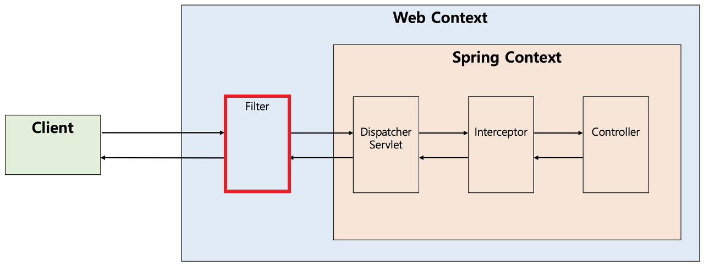
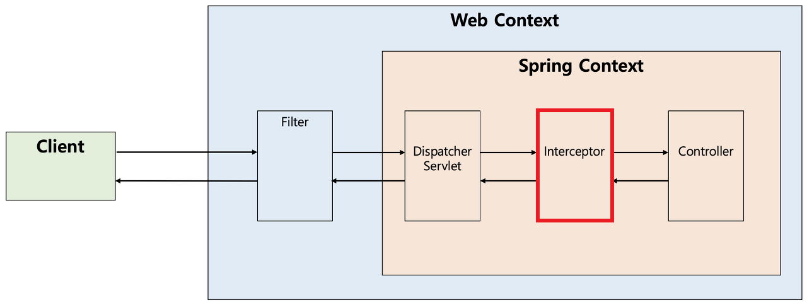

# 필터와 인터셉터

스프링부트에서 인증을 할 때는 주로 필터 기반의 스프링 시큐리티를 사용한다. 인증 방법에는 필터 뿐 아니라 인터셉터 또한 존재한다.

---

## 1️⃣ 필터

### 특징
#### - Servlet이 실행되기 전후로 요청과 응답을 처리.
#### - 주로 요청과 응답을 가공하는 용도.

### 동작 과정
#### 1. 클라이언트가 요청 전송.
#### 2. 필터 실행.
#### 3. 다음 필터 또는 서블릿으로 전달.
#### 4. 컨트롤러 실행.
#### 5. 응답 반환 후 필터 실행.
#### 6. 클라이언트에게 응답 전달.

### 구현 코드
```
public class JwtFilter extends OncePerRequestFilter {
    private final JwtUtil jwtUtil;

    public JwtFilter(JwtUtil jwtUtil) {
        this.jwtUtil = jwtUtil;
    }

    @Override
    protected void doFilterInternal(HttpServletRequest request, HttpServletResponse response, FilterChain filterChain) throws ServletException, IOException {
        String accessToken = request.getHeader("Authorization");
        // 토큰이 없다면 다음 필터로 넘김
        if (accessToken == null) {
            filterChain.doFilter(request, response);
            return;
        }

        try {
            jwtUtil.isExpired(accessToken);
        } catch (ExpiredJwtException e) {
            PrintWriter writer = response.getWriter();
            writer.print("access token expired");
            response.setStatus(HttpServletResponse.SC_UNAUTHORIZED);
            return;
        }

        CustomUserDetails customUserDetails = new CustomUserDetails(new User(jwtUtil.getEmail(accessToken)));

        Authentication authToken = new UsernamePasswordAuthenticationToken(customUserDetails, null, customUserDetails.getAuthorities());
        SecurityContextHolder.getContext().setAuthentication(authToken);

        filterChain.doFilter(request, response);
    }
}
```


## 2️⃣ 인터셉터

### 특징
#### - Servlet이 어떤 컨트롤러에 명령을 위임할지 결정하기 전에 끼어듦.
#### - Spring MVC 계층에서 동작.

### 동작 과정
#### 1. preHandle() - 컨트롤러 실행 전, 요청을 가로채 사전 처리.
#### 2. postHandle() - 컨트롤러 실행 후, 반환한 데이터를 가공.
#### 3. afterCompletion() - 요청 처리 완료 후, 응답을 클라이언트에 보내기 직전에 수행.

### 구현 코드
#### 1. preHandle()
```
@Component
public class JwtAuthCheckInterceptor implements AuthCheckInterceptor{
    @Override
    public boolean preHandle(HttpServletRequest request, HttpServletResponse response, Object handler) throws Exception {
        if(UserInfoHolder.isEmpty() || AdminInfoHolder.isEmpty()){
            throw new IllegalArgumentException("Unauthorized Access");
        }
        return true;
    }
}
```
#### 2. postHandle()
```
@Component
@RequiredArgsConstructor
public class JwtLoginSuccessInterceptor implements LoginSuccessInterceptor {


    private final JwtProperties jwtProperties;
    private final JwtProvider jwtProvider;
    
    // 로그인 성공 후 응답 헤더에 토큰 넣는 로직.
    @Override
    public void postHandle(HttpServletRequest request, HttpServletResponse response, Object handler, ModelAndView modelAndView) throws Exception {
        JwtSubject subject = getSubject();
        String role = getRole();
        if (subject != null) {
            String refreshToken = jwtProvider.generateRefreshToken(subject, role);
            String accessToken = jwtProvider.generateAccessToken(subject, role);
            addRefreshTokenToCookie(request, response, refreshToken);
            response.addHeader(JwtProvider.HEADER_AUTHORIZATION, accessToken);
        }
    }
}
```
#### 3. afterCompletion()
```
@Component
@RequiredArgsConstructor
public class JwtAuthInfoHoldInterceptor implements AuthInfoHoldInterceptor{
    private final JwtProvider jwtProvider;
    @Override
    public boolean preHandle(HttpServletRequest request, HttpServletResponse response, Object handler) throws Exception {
        String header = request.getHeader(JwtProvider.HEADER_AUTHORIZATION);
        String accessToken = JwtProvider.extractToken(header);

        if (jwtProvider.verifyToken(accessToken)){
            UserInfoHolder.releaseUserInfo();
            UserInfoHolder.setUserInfo(jwtProvider.extractUserInfo(accessToken));
        }
        return true;
    }

    @Override
    public void afterCompletion(HttpServletRequest request, HttpServletResponse response, Object handler, Exception ex) throws Exception {
        UserInfoHolder.releaseUserInfo();
    }
}
```
## 3️⃣ 정리
### 필터 사용이 적합한 경우
- #### CORS 설정
- #### JWT 인증
- #### 요청 및 응답 변환
- #### 로깅 및 모니터링 - 모든 요청의 IP, URL, HTTP 메서드 등 기록.
- #### 전역 인코딩 설정 - 모든 요청을 UTF-8로 변경.

### 인터셉터 사용이 적합한 경우
- #### 특정 API 요청을 제한
- #### API 실행 시간 측정 및 로깅
- #### 특정 요청 리디렉션